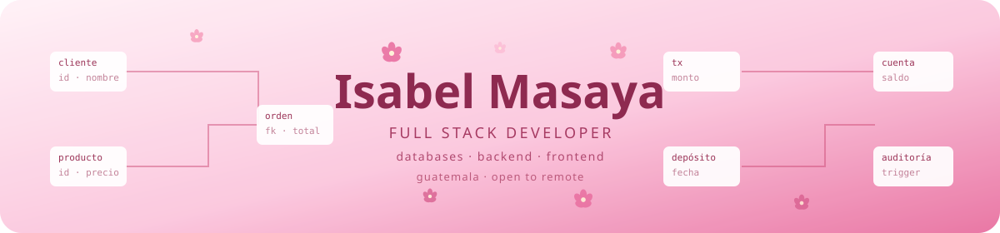

<p align="center"></p>

<p align="center">
  
  
  
  
</p>

I'm a **full stack developer** — I build the interface, the API behind it and
the database underneath. Currently on a backend/DBA team, where I design
schemas, tune queries and keep production data healthy.

Working across the stack means I can see where a problem actually starts — a
slow screen is often a missing index, not a rendering issue. The data layer is
where I go deepest: a badly designed schema doesn't hurt on day one, it hurts
six months later, in every query that drags.

I hold a degree in Computer Science and Systems Engineering from
**Universidad de San Carlos de Guatemala**, and I've been working as a
developer professionally since 2024.


## 🌷 &nbsp;What I work with

<i>Every badge links to a repository where I actually used it.</i>

**Databases**

<p>
  <a href="https://github.com/isabh17/bases-de-datos-oracle"></a>
  <a href="https://github.com/isabh17/bases-de-datos-oracle"></a>
  <a href="https://github.com/isabh17/bases-de-datos-oracle"></a>
  <a href="https://github.com/isabh17/bases-de-datos-oracle"></a>
  <a href="https://github.com/isabh17/bases-de-datos-oracle"></a>
</p>

**Backend**

<p>
  <a href="https://github.com/isabh17/bases-de-datos-oracle"></a>
  <a href="https://github.com/isabh17/bases-de-datos-oracle"></a>
  <a href="https://github.com/isabh17/distributed-voting-system"></a>
  <a href="https://github.com/isabh17/distributed-voting-system"></a>
  <a href="https://github.com/isabh17/bases-de-datos-oracle"></a>
</p>

**Infrastructure & data**

<p>
  <a href="https://github.com/isabh17/distributed-voting-system"></a>
  <a href="https://github.com/isabh17/distributed-voting-system"></a>
  <a href="https://github.com/isabh17/distributed-voting-system"></a>
  <a href="https://github.com/isabh17/distributed-voting-system"></a>
  <a href="https://github.com/isabh17/distributed-voting-system"></a>
</p>

**Frontend**

<p>
  <a href="https://github.com/isabh17/distributed-voting-system"></a>
  <a href="https://github.com/isabh17/IA1_Proyecto_17.github.io"></a>
  <a href="https://github.com/isabh17/isabh17.github.io"></a>
  <a href="https://github.com/isabh17/IA1_Proyecto_17.github.io"></a>
  <a href="https://github.com/isabh17/IA1_Proyecto_17.github.io"></a>
</p>


## 🗄️ &nbsp;Relational databases in Oracle

[**→ Repository**](https://github.com/isabh17/bases-de-datos-oracle)

Two systems taken from conceptual model to a working implementation. Neither is
a syntax exercise: both required deciding how to split entities, where the
constraints belong, and which logic deserves to live inside the engine.

<table><tr>
<td align="center" width="25%"><h3>20</h3>tables</td>
<td align="center" width="25%"><h3>10</h3>stored procedures</td>
<td align="center" width="25%"><h3>25</h3>business queries</td>
<td align="center" width="25%"><h3>20k</h3>records loaded</td>
</tr></table>

<details>
<summary><b>🛒 &nbsp;Commerce system — 7 tables + REST API</b></summary>

<br>

| Entity | Purpose |
|---|---|
| `cliente` · `vendedor` · `pais` | Actors and their location |
| `producto` · `categoria` | The catalog |
| `orden_de_venta` | Sales order header |
| `detalle` | Resolves the many-to-many between orders and products |

**The hard part** — bulk loading. Data arrives in six separate CSV files and
can't be inserted directly: it lands first in a staging table, then gets
distributed to the final tables respecting foreign-key order. 20,000 customer
records, plus 25 business queries and a Flask REST API.

</details>

<details>
<summary><b>🏦 &nbsp;Banking system — 13 tables, stored procedures, audit trail</b></summary>

<br>

The design decision here was to put transactional logic **inside the database**
rather than in the application. If a transfer has to be atomic, the engine is
the right place to guarantee it.

**Ten stored procedures** — `registrarCliente` · `registrarCuenta` ·
`realizarDeposito` · `realizarDebito` · `realizarCompra` · `asignarTransaccion` ·
`crearProductoServicio` · `registrarTipoCliente` · `registrarTipoCuenta` ·
`registrarTipoTransaccion`

**Audit triggers** — every table carries an `_audit` trigger that logs any
change to a ledger. Together they form a complete trail of who changed what and
when, which is exactly what a banking system needs to be able to prove.

</details>


## ⚙️ &nbsp;Distributed voting system on Kubernetes

[**→ Repository**](https://github.com/isabh17/distributed-voting-system)

A system that ingests a high-volume stream of votes, queues it, persists it to
two different stores and visualizes it in real time — deployed as microservices
on Kubernetes. The point was never the voting: it was what happens when
thousands of requests arrive at once and nothing is allowed to be lost.

<table><tr>
<td align="center" width="33%"><h3>6</h3>containerized services</td>
<td align="center" width="33%"><h3>15</h3>Kubernetes manifests</td>
<td align="center" width="33%"><h3>2</h3>data stores, different jobs</td>
</tr></table>

<details>
<summary><b>🔀 &nbsp;How the data flows, and why</b></summary>

<br>

```
Locust  ─▶  gRPC client ─▶ gRPC server  ─▶  Kafka  ─▶  consumer ─┬─▶ Redis    ─▶ Grafana
(load)                         (Go)        (queue)      (Go)     └─▶ MongoDB  ─▶ Node API ─▶ Vue app
```

**Why Kafka in the middle.** Writing straight from the gRPC server to the
databases caps ingestion at the speed of the slowest write. The queue decouples
them: the server only publishes, and the consumer drains at its own pace without
losing votes during a spike.

**Why two stores.** Redis holds the live counters the dashboards poll constantly;
MongoDB keeps the durable record the API queries later. Each does what it's good
at.

Load is generated with Locust to prove the pipeline holds under pressure.

`Go` · `gRPC` · `Kafka` · `Redis` · `MongoDB` · `Kubernetes` · `Grafana` · `Locust` · `Node.js` · `Vue`

</details>

## 🌸 &nbsp;A chatbot that runs in the browser

[**→ Repository**](https://github.com/isabh17/IA1_Proyecto_17.github.io) &nbsp;·&nbsp; [**✨ Live demo**](https://isabh17.github.io/IA1_Proyecto_17.github.io/)

A neural network trained with Keras that classifies natural-language intents,
then exported to TensorFlow.js.

<table><tr>
<td align="center" width="33%"><h3>784</h3>intents</td>
<td align="center" width="33%"><h3>2,075</h3>training patterns</td>
<td align="center" width="33%"><h3>0</h3>servers needed</td>
</tr></table>

<details>
<summary><b>🧠 &nbsp;How it works under the hood</b></summary>

<br>

1. **Preprocessing** — NLTK tokenizes and lemmatizes each pattern, producing the
   model's vocabulary.
2. **Representation** — every phrase becomes a bag-of-words vector.
3. **Training** — a dense Keras network maps that vector to one of the 784 intents.
4. **Deployment** — the trained model is converted to TensorFlow.js. **There is
   no server.** The browser downloads the weights and runs inference locally,
   which is why the demo works on a static host.

</details>


## 💌 &nbsp;Beyond the code

<table>
<tr>
<td width="31%" valign="top">

<a href="https://issuu.com/revistaecys/docs/vigesimaoctava-revistadigital">

</a>

</td>
<td width="69%" valign="top">

### Revista ECYS — 28th edition

**Design and layout** &nbsp;·&nbsp; published May 2026

The digital magazine of the School of Computer Science and Systems at
Universidad de San Carlos de Guatemala. I was responsible for the visual design
and the layout of the whole issue.

**This edition:** *La Nueva Ingeniería — IA, Datos y Automatización.*

- Architectures and technologies driving digital transformation
- Governance, security and ethics in digital systems
- New paradigms in software engineering
- Data-driven intelligent systems

Laying out a technical magazine means making dense material readable: managing
a type hierarchy across dozens of pages, keeping a grid consistent, and making
sure a reader can find their way through an article on system architecture
without getting lost.

**[📖 &nbsp;Read the published edition →](https://issuu.com/revistaecys/docs/vigesimaoctava-revistadigital)**

</td>
</tr>
</table>

I don't see this as separate from engineering. Making something readable and
well presented isn't decoration — it's the same instinct that makes a schema
worth reading.


## ✨ &nbsp;Currently

Open to **full stack**, **backend** and **database** roles — remote or based in
Guatemala.

<p align="center">
  <a href="mailto:silverisa17@gmail.com"></a>
  &nbsp;
  <a href="https://isabh17.github.io/"></a>
</p>

<p align="center">🎀 　 ୨୧ 　 🎀</p>
